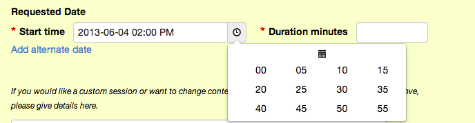
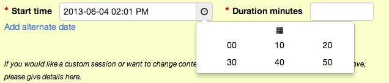

# Boostrap datepicker minutes increase ability

 - Eric Echeverri

Forked from http://www.eyecon.ro/bootstrap-datepicker/

See documentation [here](http://tarruda.github.com/bootstrap-datetimepicker/).

* 

Ability to increase minutes by using the parameter minIcrease as follows :

~~~{ruby}
$('.start-time-input').datetimepicker({
    language: 'en',
    pick12HourFormat: true, 
    pickDate: true,
    pickTime: true,
    pickSeconds: false,
    minIncrease:5
 });
~~~

minIncrease is bounded to the following Javascript object:

~~~{ruby}

     var minutesObj = {  3: { row: 5, column: 4 },  5: { row: 3,column: 4 },
                        10: { row: 2, column: 3 }, 15: { row: 1,column: 4 },
                        20: { row: 1, column: 3 }, 30: { row: 1,column: 2 },};
~~~

Any other minIncrease value defaults to 3.

* minIncrease = 5

* minIncrease = 10

